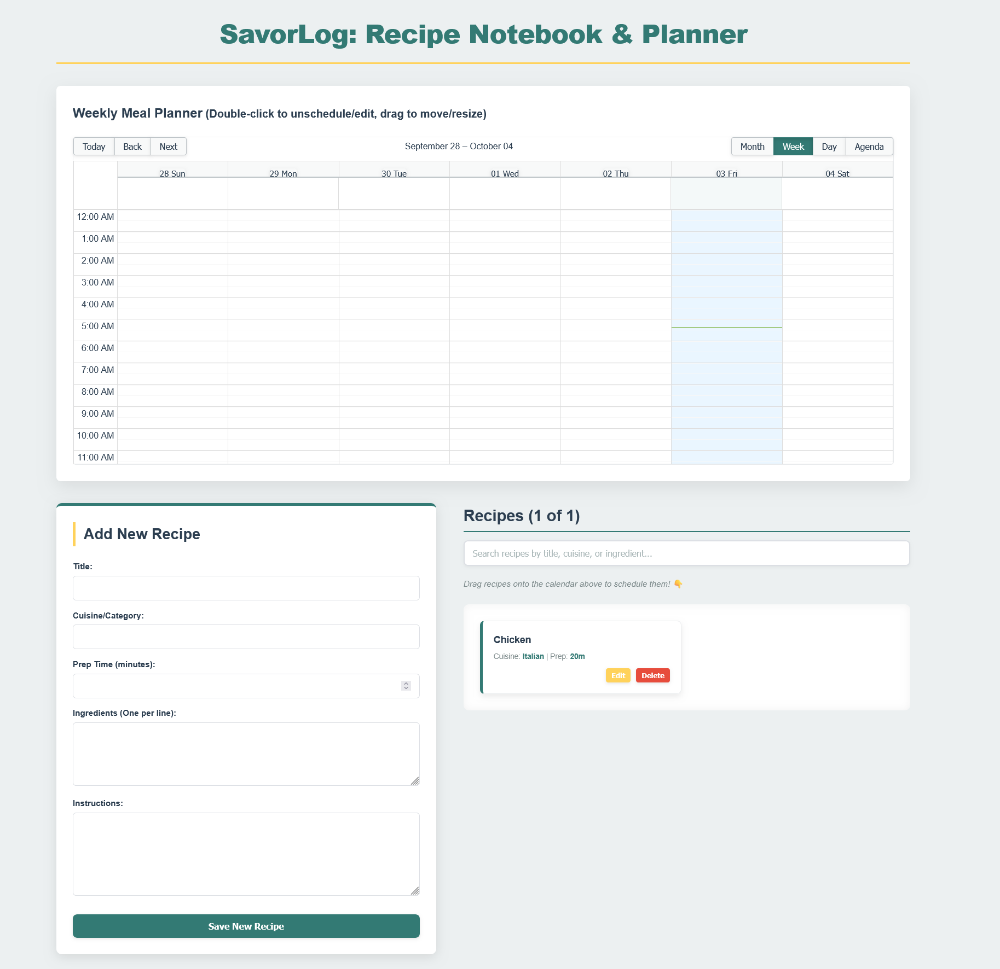

# SavorLog: MERN Stack Meal Planner 🥕📅

SavorLog is a full-stack web application designed to help users manage their recipes and plan weekly meals using a drag-and-drop calendar interface. 

***

## Project Overview

SavorLog was developed to solve the inefficiency of managing recipe collections across disparate platforms and the hassle of paper-based meal planning. It provides a single, unified platform where users can catalog their culinary collection and visually organize their week.

| Detail | Description |
| :--- | :--- |
| **Purpose** | To centralize recipe management and provide an intuitive, interactive tool for scheduling meals. |
| **What It Does** | Allows users to create, search, and manage a personal recipe database, and schedule meals using a **drag-and-drop calendar** interface. |
| **Technology Stack** | **Frontend:** React, JavaScript, HTML/CSS (`react-big-calendar`)<br>**Backend:** Node.js, Express.js<br>**Database:** MongoDB |

***

**Author:** Marjory D. Marquez

The application is built using the MERN stack:
* **MongoDB:** Database for storing recipes and meal plans.
* **Express.js & Node.js:** Backend API server.
* **React:** Frontend user interface (this repository).


## 🍽️ Application Overview

**SavorLog** helps you organize your cooking life.




***

## Case Study: Optimizing Weekly Meal Preparation 📈

The core challenge in personal meal planning is the lag between having recipe ideas and successfully committing them to a schedule. SavorLog was engineered to reduce this friction point and increase planning adherence.

| Metric | Pre-SavorLog (Manual/Paper-based) | Post-SavorLog (Digital/Interactive) |
| :--- | :--- | :--- |
| **Time to Schedule** | 15–20 minutes (writing, erasing, moving items) | **< 5 minutes** (dragging digital cards) |
| **Recipe Access** | Low (searching physical/digital files) | **High** (instant search by ingredient, title, or cuisine) |
| **Flexibility** | Low (hard to change plans) | **High** (drag-and-drop rescheduling/resizing) |
| **Digital Organization** | Fragmented across notes, links, and documents | **Centralized** (recipes and schedule in one application) |

**Result:** By integrating the recipe data directly with the scheduling interface, SavorLog enhances user efficiency and dramatically reduces the time required for weekly planning.

***


## Key Features & Functionality

### 1. Drag-and-Drop Meal Planner
* **Intuitive Scheduling:** Recipes are managed as draggable cards and scheduled simply by dropping them onto a desired date/time slot on the calendar.
* **Event Manipulation:** Users can **drag** to move and **resize** to adjust the duration of scheduled meals and notes directly on the calendar grid.
* **Local Notes:** The calendar supports creating temporary, local notes or tasks by clicking and dragging a time selection box.

### 2. Recipe Database Management
* **Full CRUD Implementation:** Complete Create, Read, Update, and Delete functionality for recipe entries via a dedicated, responsive form.
* **Structured Data:** Recipes store essential metadata including title, cuisine, ingredients, instructions, and prep time.

### 3. Dynamic Search and Filtering
* A robust search bar allows users to instantly **filter the recipe list by title, cuisine, or specific ingredients**. This ensures quick access to the right recipe regardless of the collection size.

***

## Development Rationale: Technology and Design Choices 💡

The application was developed to showcase an ability to build a scalable, data-driven system around a complex, interactive frontend component.

1.  **Full-Stack Command:** Demonstrated proficiency in the complete MERN stack, including secure API communication for data persistence (MongoDB/Express) and responsive front-end state management (React).
2.  **Advanced UI/UX Implementation:** Successfully integrated and customized the complex third-party library, `react-big-calendar`, ensuring its drag-and-drop features interact seamlessly with external, application-specific data (the recipe cards).
3.  **Data Architecture:** Solved the architectural challenge of merging two distinct data types—**persisted API data** (scheduled recipes) and **transient local state** (calendar notes)—into one unified, cohesive calendar view.

***

## 🚀 Getting Started

### Prerequisites

* Node.js (LTS recommended)
* MongoDB Instance (Local or Cloud/Atlas)

### 1. Setup Backend (Assuming it's a separate directory)

1.  Navigate to your backend directory (e.g., `savorlog-backend`).
2.  Install dependencies: `npm install`
3.  **Crucially, create a `.env` file** in the backend root directory to hold your MongoDB connection string and other secrets. **This file is ignored by Git for security.**
    ```
    # .env Example Content:
    MONGO_URI="mongodb+srv://<dbUser>:<dbPassword>@cluster-name.mongodb.net/savorlogDB?retryWrites=true&w=majority"
    PORT=5000
    ```
    > **Note:** Replace `<dbUser>`, `<dbPassword>`, and `cluster-name.mongodb.net` with your actual MongoDB Atlas connection details.

4.  Start the backend server: `npm start` (or a similar script).

### 2. Setup Frontend

1.  Navigate to this directory (`savorlog-frontend`).
2.  Install dependencies: `npm install`
3.  Start the React application: `npm run dev`

The frontend application should now be accessible at `http://localhost:5173` (or the port specified by Vite).

***

## Frontend Components

* **`App.jsx`**: Main layout, state management, and recipe data fetching.
* **`MealPlanner.jsx`**: Calendar interface with Drag and Drop for scheduling.
* **`RecipeForm.jsx`**: Component for adding new recipes via the API.
* **`src/api/api.js`**: Centralized functions for interacting with the Express API.


-----


# React + Vite

This template provides a minimal setup to get React working in Vite with HMR and some ESLint rules.

Currently, two official plugins are available:

- [@vitejs/plugin-react](https://github.com/vitejs/vite-plugin-react/blob/main/packages/plugin-react) uses [Babel](https://babeljs.io/) (or [oxc](https://oxc.rs) when used in [rolldown-vite](https://vite.dev/guide/rolldown)) for Fast Refresh
- [@vitejs/plugin-react-swc](https://github.com/vitejs/vite-plugin-react/blob/main/packages/plugin-react-swc) uses [SWC](https://swc.rs/) for Fast Refresh

## React Compiler

The React Compiler is enabled on this template. See [this documentation](https://react.dev/learn/react-compiler) for more information.

Note: This will impact Vite dev & build performances.

## Expanding the ESLint configuration

If you are developing a production application, we recommend using TypeScript with type-aware lint rules enabled. Check out the [TS template](https://github.com/vitejs/vite/tree/main/packages/create-vite/template-react-ts) for information on how to integrate TypeScript and [`typescript-eslint`](https://typescript-eslint.io) in your project.
